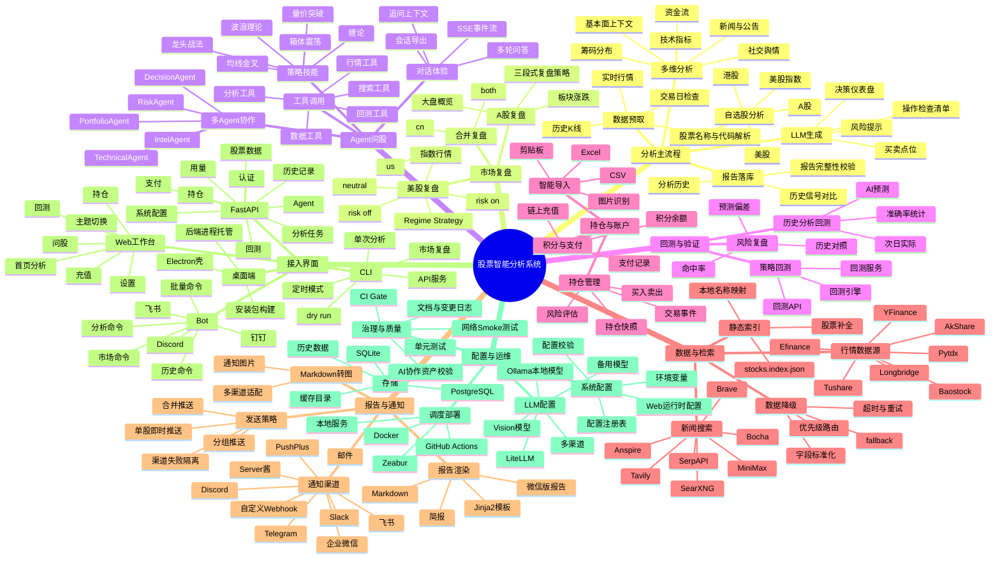

# 功能思维导图

> 本图按用户可见能力和主要运行链路组织，用于快速理解 Daily Stock Analysis 的功能边界与模块关系。

## 阅读方式

- 从“分析主流程”看一次股票分析任务如何从数据获取走到报告与通知。
- 从“接入界面”看同一能力如何通过 CLI、API、Web、桌面端和 Bot 暴露。
- 从“数据与检索”“配置与运维”看外部依赖、降级路径和部署配置。
- 从“Agent问股”“回测与验证”“持仓与账户”看交互式分析、效果验证和投资组合相关能力。
